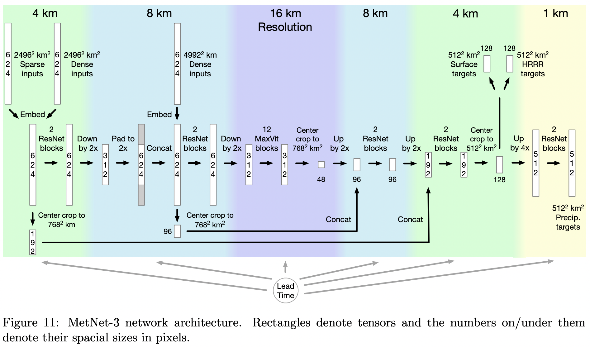

</img>

## MetNet-3 - Pytorch

Implementation of <a href="https://blog.research.google/2023/11/metnet-3-state-of-art-neural-weather.html">MetNet 3</a>, SOTA neural weather model out of Google Deepmind, in Pytorch

The model architecture is pretty unremarkable. It is basically a U-net with a specific <a href="https://arxiv.org/abs/2204.01697">well performing vision transformer</a>. The most interesting thing about the paper may end up being the loss scaling in section 4.3.2

## Appreciation

- <a href="https://stability.ai/">StabilityAI</a>, <a href="https://a16z.com/supporting-the-open-source-ai-community/">A16Z Open Source AI Grant Program</a>, and <a href="https://huggingface.co/">🤗 Huggingface</a> for the generous sponsorships, as well as my other sponsors, for affording me the independence to open source current artificial intelligence research

## Install

```bash
$ pip install metnet3-pytorch
```

## Usage

```python
import torch
from metnet3_pytorch import MetNet3

metnet3 = MetNet3(
    dim = 512,
    num_lead_times = 722,
    lead_time_embed_dim = 32,
    input_spatial_size = 624,
    attn_dim_head = 8,
    hrrr_channels = 617,
    input_2496_channels = 2 + 14 + 1 + 2 + 20,
    input_4996_channels = 16 + 1,
    precipitation_target_bins = dict(
        mrms_rate = 512,
        mrms_accumulation = 512,
    ),
    surface_target_bins = dict(
        omo_temperature = 256,
        omo_dew_point = 256,
        omo_wind_speed = 256,
        omo_wind_component_x = 256,
        omo_wind_component_y = 256,
        omo_wind_direction = 180
    ),
    hrrr_loss_weight = 10,
    hrrr_norm_strategy = 'sync_batchnorm',  # this would use a sync batchnorm to normalize the input hrrr and target, without having to precalculate the mean and variance of the hrrr dataset per channel
    hrrr_norm_statistics = None             # you can also also set `hrrr_norm_strategy = "precalculated"` and pass in the mean and variance as shape `(2, 617)` through this keyword argument
)

# inputs

lead_times = torch.randint(0, 722, (2,))
hrrr_input_2496 = torch.randn((2, 617, 624, 624))
hrrr_stale_state = torch.randn((2, 1, 624, 624))
input_2496 = torch.randn((2, 39, 624, 624))
input_4996 = torch.randn((2, 17, 624, 624))

# targets

precipitation_targets = dict(
    mrms_rate = torch.randint(0, 512, (2, 512, 512)),
    mrms_accumulation = torch.randint(0, 512, (2, 512, 512)),
)

surface_targets = dict(
    omo_temperature = torch.randint(0, 256, (2, 128, 128)),
    omo_dew_point = torch.randint(0, 256, (2, 128, 128)),
    omo_wind_speed = torch.randint(0, 256, (2, 128, 128)),
    omo_wind_component_x = torch.randint(0, 256, (2, 128, 128)),
    omo_wind_component_y = torch.randint(0, 256, (2, 128, 128)),
    omo_wind_direction = torch.randint(0, 180, (2, 128, 128))
)

hrrr_target = torch.randn(2, 617, 128, 128)

total_loss, loss_breakdown = metnet3(
    lead_times = lead_times,
    hrrr_input_2496 = hrrr_input_2496,
    hrrr_stale_state = hrrr_stale_state,
    input_2496 = input_2496,
    input_4996 = input_4996,
    precipitation_targets = precipitation_targets,
    surface_targets = surface_targets,
    hrrr_target = hrrr_target
)

total_loss.backward()

# after much training from above, you can predict as follows

metnet3.eval()

surface_preds, hrrr_pred, precipitation_preds = metnet3(
    lead_times = lead_times,
    hrrr_input_2496 = hrrr_input_2496,
    hrrr_stale_state = hrrr_stale_state,
    input_2496 = input_2496,
    input_4996 = input_4996,
)


# Dict[str, Tensor], Tensor, Dict[str, Tensor]
```

## Todo

- [x] figure out all the cross entropy and MSE losses
- [x] auto-handle normalization across all the channels of the HRRR by tracking a running mean and variance of targets during training (using sync batchnorm as hack)
- [x] allow researcher to pass in their own normalization variables for HRRR
- [x] build all the inputs to spec, also make sure hrrr input is normalized, offer option to unnormalize hrrr predictions
- [x] make sure model can be easily saved and loaded, with different ways of handling hrrr norm

- [ ] figure out the topological embedding, consult a neural weather researcher

## Citations

```bibtex
@article{Andrychowicz2023DeepLF,
    title   = {Deep Learning for Day Forecasts from Sparse Observations},
    author  = {Marcin Andrychowicz and Lasse Espeholt and Di Li and Samier Merchant and Alexander Merose and Fred Zyda and Shreya Agrawal and Nal Kalchbrenner},
    journal = {ArXiv},
    year    = {2023},
    volume  = {abs/2306.06079},
    url     = {https://api.semanticscholar.org/CorpusID:259129311}
}
```

```bibtex
@inproceedings{ElNouby2021XCiTCI,
    title   = {XCiT: Cross-Covariance Image Transformers},
    author  = {Alaaeldin El-Nouby and Hugo Touvron and Mathilde Caron and Piotr Bojanowski and Matthijs Douze and Armand Joulin and Ivan Laptev and Natalia Neverova and Gabriel Synnaeve and Jakob Verbeek and Herv{\'e} J{\'e}gou},
    booktitle = {Neural Information Processing Systems},
    year    = {2021},
    url     = {https://api.semanticscholar.org/CorpusID:235458262}
}
```
